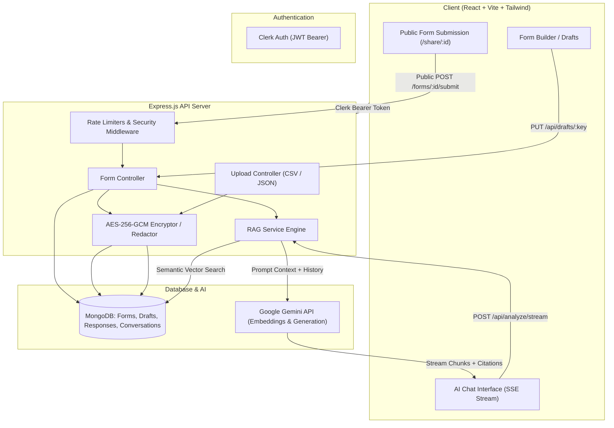

# CipherForm 🛡️🤖

> **Privacy-First Form Builder & Intelligent RAG Analytics Engine**  
> Build dynamic forms, encrypt sensitive respondent data with AES-256-GCM, and query unstructured form submissions conversationally using semantic vector search and Google Gemini.

---

## 🌟 Key Features

- **📝 Dynamic Form Builder & Schema Designer:**
  - Create customizable forms supporting text, textarea, number, email, tel, date, dropdowns (enum), booleans, and visual sections.
  - Multi-draft auto-save (synced to MongoDB and browser `localStorage`) with quick-resume and draft management.

- **🔒 Advanced Privacy & Cryptographic Storage:**
  - **AES-256-GCM Authenticated Encryption:** Sensitive responses are encrypted at rest with unique IVs and authentication tags.
  - **Granular Field Privacy Modes:**
    - `private`: Encrypted at rest. Completely omitted from AI context.
    - `derived`: Raw values encrypted; only non-sensitive metadata extracted (e.g. phone country codes, email domains).
    - `redacted_analyzable`: PII (emails, phone numbers, identifiers) auto-redacted before semantic vectorization.
    - `analyzable`: Clean text vectorized for rich semantic analytics.

- **🧠 Real-Time RAG AI Analytics:**
  - Powered by **Google Gemini** models with automatic model fallback.
  - **Semantic Vector Retrieval:** Computes 768-dimensional normalized embeddings for instant hybrid similarity lookup.
  - **Conversational Memory & Query Condensation:** Multi-turn conversational context resolution (e.g., resolving pronouns like *"how did they rate the product?"*).
  - **Real-Time Streaming:** Server-Sent Events (SSE) streaming with granular record citations and relevance confidence scores.

- **🔐 Multi-Tenant Authentication (Clerk):**
  - Full authentication powered by **Clerk** (`@clerk/react` & `@clerk/backend`).
  - Strict tenant isolation: every form, draft, conversation, and response is scoped to `ownerId`.
  - Public respondent links (`/share/:id`) require no login for smooth submission workflows.

- **📊 Bulk Ingestion & CSV/JSON Uploads:**
  - Upload CSV or JSON files with automated field mapping, batch encryption, and rate-limited vectorization (capped at 1,000 records per upload).

- **⚡ Production-Grade Security & Keep-Alive:**
  - **Rate Limiting:** IP-based rate limiters on public submissions, queries, uploads, and AI chat.
  - **Security Headers:** HSTS, `X-Content-Type-Options: nosniff`, `X-Frame-Options: DENY`, strict CORS with preflight handling.
  - **Prompt Injection Defense:** XML-boundary delimited prompt templates (`<context_data>`, `<chat_history>`, `<user_query>`).
  - **Render.com Keep-Alive:** Integrated self-ping background worker and `/api/ping` endpoint to prevent free cloud instances from sleeping.

---

## 🏗️ Architecture & Data Flow



---

## 🛡️ Field Privacy Policies

| Policy | Storage Mode | Vector Indexing | Visible in AI Analysis? |
| :--- | :--- | :--- | :--- |
| **`private`** | AES-256-GCM Encrypted | Excluded from vector embedding | ❌ Never passed to AI |
| **`derived`** | AES-256-GCM Encrypted | Safe metadata only (Domain, Country Code) | 🌐 Safe metadata only |
| **`redacted_analyzable`** | AES-256-GCM Encrypted | PII Auto-Redacted (`[EMAIL]`, `[PHONE]`) | 🛡️ Sanitized text only |
| **`analyzable`** | Encrypted or Plaintext | Full semantic embedding | 📊 Full field content |

---

## 📁 Repository Structure

```
rag_forms/
├── client/                     # React Frontend (Vite, TailwindCSS)
│   ├── src/
│   │   ├── components/         # AdminGate, Sidebar, ResponsesGrid
│   │   ├── pages/              # Dashboard, CreateForm, ChatInterface, PublicForm, Landing
│   │   ├── utils/              # Seed data and helpers
│   │   ├── axios.js            # Axios client with automated Clerk JWT interceptor
│   │   ├── App.jsx             # React Router configuration
│   │   └── main.jsx            # ClerkProvider & Root
│   └── package.json
│
├── server/                     # Node.js Express Backend
│   ├── controllers/            # formController.js, uploadController.js
│   ├── middleware/             # adminAuth.js (Clerk), validateId.js (ObjectId check)
│   ├── models/                 # Form.js, Response.js, Conversation.js, FormDraft.js
│   ├── routes/                 # formRoutes.js (Rate limited & validated API routes)
│   ├── services/               # ragService.js (Gemini RAG & Vector similarity)
│   ├── config.js               # Environment config parser
│   ├── server.js               # Express app, security headers, CORS & Keep-Alive worker
│   └── package.json
│
└── README.md
```

---

## 📡 API Reference

### Public Endpoints (Rate Limited)
- `GET /ping` or `GET /api/ping`: Lightweight health check & uptime status.
- `GET /api/forms/:id`: Fetch public form schema fields.
- `POST /api/forms/:id/submit`: Submit form response (Rate limit: 30 requests / 10 min).

### Authenticated Endpoints (Requires `Authorization: Bearer <clerk_jwt>`)
- `GET /api/forms`: Retrieve all forms belonging to current user.
- `POST /api/forms`: Create and publish a new form.
- `GET /api/forms/:id/admin`: Fetch administrative form details and response counts.
- `PUT /api/forms/:id`: Update form definition and privacy modes.
- `DELETE /api/forms/:id`: Delete a form and cascade-delete all associated responses/conversations.
- `GET /api/forms/:id/responses`: Paginated responses table with server-side decryption.
- `POST /api/forms/:id/upload`: Upload CSV/JSON responses (Max 1,000 records per upload).
- `GET /api/drafts`: List all in-progress draft forms.
- `GET /api/drafts/:draftKey`: Fetch a specific draft schema.
- `PUT /api/drafts/:draftKey`: Auto-save or update draft schema.
- `DELETE /api/drafts/:draftKey`: Discard draft schema.
- `POST /api/analyze`: Non-streaming RAG question answering.
- `POST /api/analyze/stream`: Real-time SSE streaming RAG question answering with citations.
- `GET /api/forms/:id/conversations`: Fetch recent AI conversation history.
- `DELETE /api/forms/:id/conversations`: Clear conversation history.

---

## ⚙️ Environment Variables

### Backend (`server/.env`)
```ini
PORT=5001
MONGODB_URI=mongodb+srv://<username>:<password>@cluster.mongodb.net/rag_forms
GEMINI_API_KEY=AIzaSy...
CLERK_SECRET_KEY=sk_test_...
APP_DATA_KEY=your_secure_32_character_encryption_key_here
CORS_ORIGIN=http://localhost:5173,http://localhost:3000

# Optional: Cloud keep-alive (Auto-detected on Render.com)
RENDER_EXTERNAL_URL=https://your-backend.onrender.com
```

### Frontend (`client/.env`)
```ini
VITE_APP_API_URL=http://localhost:5001
VITE_CLERK_PUBLISHABLE_KEY=pk_test_...
```

---

## 🚀 Quickstart & Local Setup

### Prerequisites
- Node.js (v18+) or [Bun](https://bun.sh)
- MongoDB Database (Local instance or MongoDB Atlas)
- Google Gemini API Key ([Google AI Studio](https://aistudio.google.com/))
- Clerk Application ([Clerk Dashboard](https://dashboard.clerk.com/))

### 1. Clone Repository
```bash
git clone https://github.com/ShlokRamteke/rag_forms.git
cd rag_forms
```

### 2. Setup Backend
```bash
cd server
npm install
# or: bun install

# Create .env file with your credentials
cp .env.example .env

# Start server
npm start
# or: bun start
```

### 3. Setup Frontend
```bash
cd ../client
npm install
# or: bun install

# Create .env file with your credentials
cp .env.example .env

# Start development server
npm run dev
# or: bun run dev
```

Visit **`http://localhost:5173`** in your browser.

---

## ☁️ Deployment Guide

### Deploy Backend (Render.com)
1. Create a new **Web Service** on Render connected to this repository.
2. Set Root Directory to `server`.
3. Build Command: `npm install` (or `bun install`).
4. Start Command: `node server.js` (or `bun start`).
5. Add Environment Variables (`MONGODB_URI`, `GEMINI_API_KEY`, `CLERK_SECRET_KEY`, `APP_DATA_KEY`, `CORS_ORIGIN`).
6. Render will automatically configure `RENDER_EXTERNAL_URL` and keep the service warm via the built-in 14-minute worker.

### Deploy Frontend (Vercel / Netlify / Cloudflare Pages)
1. Create a new project connected to the `client` directory.
2. Build Command: `npm run build`
3. Output Directory: `dist`
4. Set Environment Variables:
   - `VITE_APP_API_URL`: URL of your deployed backend (e.g. `https://your-app.onrender.com`)
   - `VITE_CLERK_PUBLISHABLE_KEY`: Clerk publishable key

---

## 📄 License
This project is licensed under the MIT License.
